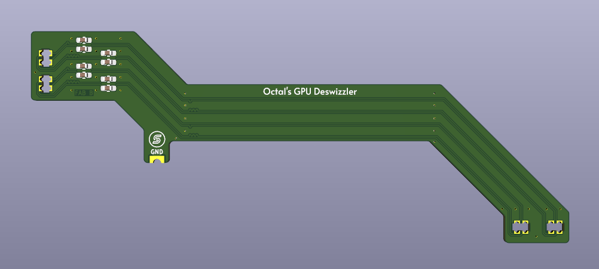

# Octal's Deswizzler QSB

QSB for installing Rhea, Zeus, or Kronos on Xenon or Zephyr_A Xbox 360 motherboards by deswizzling the PCIe traces.

Correctly routes the PCIe traces with appropriate length/impedance matching, and isolation from other traces for signal integrity.

A few other component changes must be made on the motherboard for Zeus and Kronos. See the install guide here: [XenonLibrary: GPU Retrofit](https://xenonlibrary.com/wiki/GPU_Retrofit#Xenon/Zephyr_A "XenonLibrary: GPU Retrofit")

Requires 8pcs 0.1uF 6.3V X5R 0402 capacitors, you can take them from the board or install new ones. Board thickness MUST be 0.6mm!

Demo video: [YouTube: Octal's Xbox 360 GPU Deswizzler QSB](https://www.youtube.com/watch?v=Wnud3SFgy1c "YouTube: Octal's Xbox 360 GPU Deswizzler QSB")

